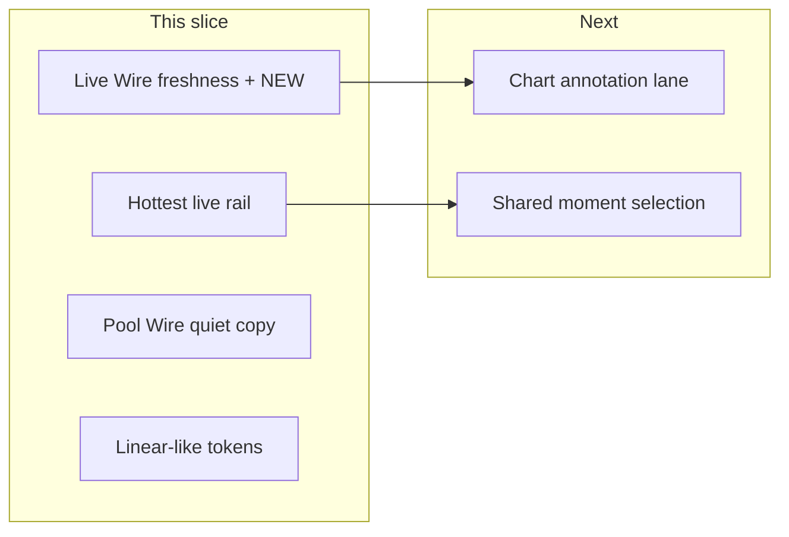

# Hub P0 + Linear density (first delivery)

## Audit verdict (locked)

[docs/website-portal/analytics-product-refactor-audit-2026-07-10.md](docs/website-portal/analytics-product-refactor-audit-2026-07-10.md) already decides hybrid **A+C**. This plan executes **P0 only** plus a **hub visual density** pass. Out of scope for this slice: chart annotation lane (P1), Emote Market / screener (P2), public clips (P3), full session-console context rail.

## Verified baseline (read-only review 2026-07-10)

All five delivery items are **genuinely unimplemented**. Focused suites (27 tests) and `check:analytics-overlap` pass while still blessing pre-P0 behavior.

| Severity | Finding | Evidence |
|---|---|---|
| High | Live Wire has no age cutoff; `NEW` = client-first-seen | [HubLiveWireFeed.tsx](streampulse-web/src/ui/components/analytics/HubLiveWireFeed.tsx) — filter by lifecycle only; `collectFreshKeys` / `activeNewKeys` |
| High | Rail is viewer-slice + “Featured live channels” | [AnalyticsLandingPage.tsx](streampulse-web/src/routes/analytics/AnalyticsLandingPage.tsx) `liveChannels.slice(0, 12)`; [commandCenterLabels.ts](streampulse-web/src/ui/themes/commandCenterLabels.ts); cards omit chat/emote rates in [FigmaLiveChannelRail.tsx](streampulse-web/src/ui/components/analytics/FigmaLiveChannelRail.tsx) |
| Medium | Pool Wire idle is a full panel | [PoolWire.tsx](streampulse-web/src/ui/components/analytics/PoolWire.tsx) `Waiting for lifecycle changes`; [HubCommandHeader.test.tsx](streampulse-web/tests/HubCommandHeader.test.tsx) asserts that copy |
| Medium | Density + hub fonts absent | Section gap `1.35rem`, large radii/thumbs/chip min-height in [figma-analytics.css](streampulse-web/src/ui/components/analytics/figma-analytics.css); `@fontsource` only via [analytics-tailwind.css](streampulse-web/src/ui/analytics-tailwind.css) (console), not hub import chain |
| Low | Session notice overlap | Sibling [AnalyticsConsole.tsx](../streampulse-backend/packages/analytics-console/src/components/AnalyticsConsole.tsx) mounts `CoverageStartBanner` + `StreamQualityBanner` consecutively; `live_viewer_warmup` can emit the same “Viewer samples started…” string |

**Implementability note:** `HubLiveChannel` already has `chatPerMin` / `emotesPerMin`; [activityBucketInspectorUtils.ts](streampulse-web/src/ui/components/analytics/activityBucketInspectorUtils.ts) `resolveTopLiveStreamers` / activity comparator is the shared order — no second scoring engine.

## Design translation (Linear → StreamPulse)

Borrow Linear’s **density and hierarchy**, not its indigo brand:

| Linear cue                            | StreamPulse mapping                                                                                                                                                                                   |
| ------------------------------------- | ----------------------------------------------------------------------------------------------------------------------------------------------------------------------------------------------------- |
| `#0e0e0e` / `#111113` elevation       | Keep `--sp-bg` / `--sp-surface-*` in [command-center.css](streampulse-web/src/ui/themes/analytics-themes/command-center.css); nudge borders toward `rgba(255,255,255,0.05)` and tighten panel padding |
| Inter 13–14px + 11px uppercase labels | Tighten `--sp-type-*` in [analytics-surfaces.css](streampulse-web/src/ui/themes/analytics-surfaces.css) / [analytics-typography.css](streampulse-web/src/ui/themes/analytics-typography.css)          |
| JetBrains Mono metadata               | Keep **IBM Plex Mono** (`--fma-mono`) — already the hub mono; no new font dep                                                                                                                         |
| Accent `#5e6ad2`                      | **Do not adopt** — keep teal `#5eead4`                                                                                                                                                                |
| `cubic-bezier(0.16, 1, 0.3, 1)`       | Use for Live Wire enter / Hottest rank flash via existing [useAnalyticsMotion.tsx](streampulse-web/src/ui/motion/useAnalyticsMotion.tsx)                                                              |
| Dense rows / subtle active tint       | Hottest cards + Live Wire chips use `--sp-surface-3` / `--sp-surface-active`; no new `rgba(255,255,255,…)` card fills ([streamclone.mdc](.cursor/rules/streamclone.mdc))                              |

## 1. Live Wire: freshness + honest NEW

Primary file: [HubLiveWireFeed.tsx](streampulse-web/src/ui/components/analytics/HubLiveWireFeed.tsx)

- Add a hard client window: `**LIVE_WIRE_MAX_AGE_MS = 30 * 60 * 1000**` (audit P0; server `expiresAt` deferred to P1).
- Filter feed moments so chips older than 30m never render (quiet empty: `No network breakouts in the last 30m`).
- Gate `NEW` / enter animation: only if `isLiveNetwork` **and** event age ≤ window **and** newly observed this poll. Stale-first-seen events must not badge or animate.
- Cap visible ticker to fresh events only (still max ~3 animated entries per poll).
- Update [hubLiveWireFeed.test.tsx](streampulse-web/tests/hubLiveWireFeed.test.tsx) for: old events hidden, NEW impossible on aged events, quiet empty copy.

## 2. Featured rail → Hottest live (no new Go contract)

Today [AnalyticsLandingPage.tsx](streampulse-web/src/routes/analytics/AnalyticsLandingPage.tsx) does `data.liveChannels.slice(0, 12)` (viewer order). Inspector already ranks via [activityBucketInspectorUtils.ts](streampulse-web/src/ui/components/analytics/activityBucketInspectorUtils.ts) (`rankLivePoolByActivity` / max chat+emote).

- Reuse that **same** activity ordering for the rail (shared helper — one formula, not a second client score).
- Rename label in [commandCenterLabels.ts](streampulse-web/src/ui/themes/commandCenterLabels.ts): `Featured live channels` → `Hottest live`.
- Enrich [FigmaLiveChannelRail.tsx](streampulse-web/src/ui/components/analytics/FigmaLiveChannelRail.tsx) cards: chat/m, emotes/m, viewers as secondary; optional reason string derived from dominant rate (`emote-led` / `chat-led` / `viewer-led`) as **display label only**, not a Pulse score.
- Rank delta / `hottestLive` API fields stay for a later backend contract; v1 honesty = activity-led order matching the inspector.

## 3. Pool Wire quiet state

[PoolWire.tsx](streampulse-web/src/ui/components/analytics/PoolWire.tsx) / header wiring in [HubCommandHeader.tsx](streampulse-web/src/ui/components/analytics/HubCommandHeader.tsx):

- Replace large `Waiting for lifecycle changes` with compact quiet copy: `POOL  Stable` (or `Stable for Xm` if last event age is known).
- Keep lifecycle events when present; do not invent openings client-side.

## 4. Linear-like density pass (hub only)

Token/CSS first, then component padding:

- [command-center.css](streampulse-web/src/ui/themes/analytics-themes/command-center.css): slightly stronger surface separation, softer borders (`~0.05`), `--sp-ease-out: cubic-bezier(0.16, 1, 0.3, 1)`.
- [figma-analytics.css](streampulse-web/src/ui/components/analytics/figma-analytics.css): reduce `.figma-analytics__main` section gap below `1.35rem`; shrink command-header padding/radius; Hottest thumbs below 84px; Live Wire chip `min-height` below `2.25rem`; 11px uppercase sidebar labels.
- **Hub font load:** import `@fontsource/inter` + `@fontsource/ibm-plex-mono` from the hub CSS entry ([figma-analytics.css](streampulse-web/src/ui/components/analytics/figma-analytics.css) or a tiny `analytics-hub-fonts.css` imported there) so `/analytics` does not depend on console-only [analytics-tailwind.css](streampulse-web/src/ui/analytics-tailwind.css).
- No indigo theme; no purple glow; no perpetual marquee.

## 5. Session notice dedupe (small P0)

Sibling package path (confirmed active overlap):

- [AnalyticsConsole.tsx](../streampulse-backend/packages/analytics-console/src/components/AnalyticsConsole.tsx) renders `CoverageStartBanner` and `StreamQualityBanner` in the same column.
- [streamQuality.ts](../streampulse-backend/packages/analytics-console/src/utils/streamQuality.ts) `live_viewer_warmup` can emit `Viewer samples started at…`, duplicating [ConsoleBits.tsx](../streampulse-backend/packages/analytics-console/src/components/analytics/ConsoleBits.tsx) `CoverageStartBanner`.

Fix: one owner for that string — suppress warmup diagnosis when `CoverageStartBanner` already covers the same offset, or drop the banner and keep Quality only. Add a combined-state unit/integration assertion.

## 6. Docs + verification

- Update [analytics-command-center-layout.md](docs/website-portal/analytics-command-center-layout.md): Live Wire ≤30m; rail = Hottest live; quiet Pool Wire.
- Mark P0 done in the product audit when shipped.
- **Test debt to flip (not just add):**
  - [hubLiveWireFeed.test.tsx](streampulse-web/tests/hubLiveWireFeed.test.tsx) — add stale hidden / NEW age-gated / quiet empty.
  - [HubCommandHeader.test.tsx](streampulse-web/tests/HubCommandHeader.test.tsx) — stop asserting `Waiting for lifecycle changes`.
  - [commandCenterLabels.test.ts](streampulse-web/tests/commandCenterLabels.test.ts) — expect `Hottest live`.
  - e2e: [analytics-hub-live-wire-ticker.spec.ts](streampulse-web/tests/e2e/analytics-hub-live-wire-ticker.spec.ts) / hub-ux as needed for freshness copy.
- `cd streampulse-web && npm run check:analytics-overlap` before claiming done.

## Explicit non-goals (this slice)

- Chart-attached annotation lane / marker sync (P1).
- Backend `HubLiveAnnotation` / `HubHottestLive` contract.
- Emote Market breadth/rotation, TradingView screener views.
- Jumpable peaks / Top clips / ReplayForge.
- Landing-page aquarium / Pepe work from earlier brainstorm.

