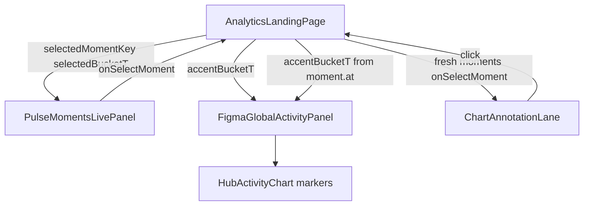

# Hub P1 Annotation Sync + P2/P3 Roadmap

## Goal

**P1:** Make Live Wire a **chart-attached annotation layer** for fresh peaks, and give the hub **one selected moment** shared across chart accent, Pulse Moments table, and annotations. Hottest live + Pool Wire quiet copy already shipped in P0.

**Later:** **P2** Emote Market + Channel Screener; **P3** Top clips — both contract-gated and out of the P1 implementation slice.

## Locked decisions (P1)

- Primary click on annotation/marker **selects** the moment (syncs table + chart accent). Deep-link to channel analytics stays a secondary control (existing href affordance), not the default chip click.
- Keep client **30m** freshness from P0 (no backend `expiresAt` yet).
- Do **not** move the moment inspector into the chart rail (layout anti-regression).
- Skip Compare-signals quadrant (defer to later analysis work).

## Architecture (P1)

Lift selection to [`AnalyticsLandingPage.tsx`](streampulse-web/src/routes/analytics/AnalyticsLandingPage.tsx). Props already exist but are unwired: `focusedMoment`, `accentBucketT` on the chart panel; `onSelectMoment` / `selectedMomentKey` on Pulse Moments.

## 1. Shared moment selection (foundation)

**Files:** [`AnalyticsLandingPage.tsx`](streampulse-web/src/routes/analytics/AnalyticsLandingPage.tsx), [`PulseMomentsLivePanel.tsx`](streampulse-web/src/ui/components/analytics/PulseMomentsLivePanel.tsx), [`FigmaGlobalActivityPanel.tsx`](streampulse-web/src/ui/components/analytics/FigmaGlobalActivityPanel.tsx)

- Page state: `selectedMomentKey`; resolve `selectedMoment` from live/bucket/pool moments via `momentRowKey`.
- Pass `selectedMomentKey` + `onSelectMoment` into embedded `PulseMomentsLivePanel` (enable hub-controlled mode).
- Derive `accentBucketT` from `activityBucketKey(selectedMoment.at, windowMinutes)`; pass to `FigmaGlobalActivityPanel`.
- Moment row select → accent chart bucket + keep table selection.
- Clearing the chart bucket (or selecting a different bucket than the moment’s) clears moment selection.
- Test: moment select sets accent; bucket clear clears moment.

## 2. Chart moment markers

**Files:** [`HubActivityChart.tsx`](streampulse-web/src/ui/components/hub/HubActivityChart.tsx), [`FigmaGlobalActivityPanel.tsx`](streampulse-web/src/ui/components/analytics/FigmaGlobalActivityPanel.tsx)

- Prop `momentMarkers: { key, bucketT, kind }[]` (fresh peaks only, capped ~8–12).
- Small pins on the plot at marker `bucketT` (reuse existing bucket x mapping).
- Click marker → `onSelectMoment(key)`.
- Selected marker uses accent styling; `prefers-reduced-motion` respected (no flourish).

## 3. Annotation lane replaces ticker placement

**Files:** evolve [`HubLiveWireFeed.tsx`](streampulse-web/src/ui/components/analytics/HubLiveWireFeed.tsx) or add [`ChartAnnotationLane.tsx`](streampulse-web/src/ui/components/analytics/ChartAnnotationLane.tsx); [`AnalyticsLandingPage.tsx`](streampulse-web/src/routes/analytics/AnalyticsLandingPage.tsx); [`figma-analytics.css`](streampulse-web/src/ui/components/analytics/figma-analytics.css)

- Mount Live Wire **inside** `.figma-activity-hub` chart stack (under range controls / above plot), not as a full-width sibling above the whole hub block.
- Compact one-line annotations for ≤30m peaks; quiet: `No network breakouts in the last 30m`.
- Click → `onSelectMoment` (same as markers/table).
- Enter animation: max 3 per poll via `useAnalyticsMotion`; pause when `document.hidden`; reduced-motion → immediate settle.

## 4. Docs + verification (P1)

- Update [`analytics-command-center-layout.md`](docs/website-portal/analytics-command-center-layout.md): annotation lane + shared selection.
- Mark P1 progress in [`analytics-product-refactor-audit-2026-07-10.md`](docs/website-portal/analytics-product-refactor-audit-2026-07-10.md).
- Unit + targeted e2e; `npm run check:analytics-overlap`.

## Explicit non-goals (P1 slice)

- Compare-signals quadrant.
- Backend `HubLiveAnnotation` / `expiresAt`.
- Out of P1; planned as contract-gated P2 and P3 below.
- Moment inspector in chart rail.

---

## P2 — Emote Market + Channel Screener

### Goal

Create two analysis products with jobs distinct from Pulse Moments:

- Emote Market answers which reactions are leading, spreading, concentrating, or rotating.
- Channel Screener answers which tracked channels match activity, coverage, freshness, or anomaly conditions.

### Emote Market

Evolve [`FigmaEmoteSignalBlock.tsx`](streampulse-web/src/ui/components/analytics/FigmaEmoteSignalBlock.tsx), retaining existing backend-owned leaders, provider share, unique-emote count, and concentration data.

Views/modules:

- Leaders
- Breadth
- Concentration
- Rotation
- Provider regime

Existing `PublicHub.emoteIntel`, `topEmotes`, and `topMovers` may support leaders, provider mix, and current concentration. Breadth across channels, equal-window rank changes, entrants/exits, and co-movement require sanitized backend aggregations with range and watermark metadata.

Do not infer cross-channel breadth or rotation from the bounded browser payload. Do not introduce client Pulse scoring. Filters may include provider and channel when supported by the contract.

### Channel Screener

Evolve [`LiveChannelsMatrix.tsx`](streampulse-web/src/ui/components/analytics/LiveChannelsMatrix.tsx); do not create a second channel directory.

Views:

- Overview
- Momentum
- Coverage
- Anomalies

Keep rows dense, searchable, sortable, keyboard accessible, and responsive. Current hub fields support viewers, chat/min, emotes/min, category, coverage, and basic trend. Acceleration, divergence, anomaly reason, newly-live state, and authoritative freshness require backend-owned fields.

Useful filters include category, coverage state, data freshness, newly live, chat acceleration, emote acceleration, and viewer/chat divergence. Do not manufacture these from client poll history. Preserve active range and selected bucket in channel links when the destination contract supports them.

### P2 Verification

Add contract normalization tests, market module tests, screener sort/filter tests, keyboard tests, responsive Playwright checks, and empty/degraded states. Update `analytics-command-center-layout.md` and the July 10 product audit.

---

## P3 — Top Clips

### Contract Gate

Top clips must not use the existing beta-key-gated `/v1/pulse/clips` candidate queue as a public data source. That route is private review state (see analytics-console `clipCandidates` / private queue contract).

Require a sanitized public read model containing only publishable clips with:

- stable public ID
- channel/display identity
- title
- verified thumbnail
- verified playback or public share URL
- duration
- published timestamp
- optional sanitized top reaction
- analytics/VOD context link

Backend owns ordering and eligibility. A candidate, queued job, or `worker_ready_unverified` job is not a public clip.

ReplayForge remains the owner of jobs, editor state, renders, artifacts, publishing, and signed playback. Follow its canonical StreamPulse import contract; do not add clipper/editor behavior to the portal or Streamclone.

### Top Clips Shelf

Add a dedicated Top clips shelf separate from Hottest live and Pulse Moments. Render only server-approved, playback-verified items. Primary action opens the published clip; analytics or VOD context is secondary.

If no eligible clips exist, omit the shelf or show a quiet honest empty state. Never fabricate thumbnails, treat moment candidates as rendered clips, expose private notes/status, or rank clips in React.

### P3 Verification

Test public sanitization, backend ordering, playback readiness, missing-media rejection, zero-item behavior, responsive layout, keyboard access, and absence of beta-key/private candidate fields.

---

## Roadmap Acceptance

- P1 has one selected moment shared by annotations, chart, and Pulse Moments.
- P2 Market and Screener answer distinct questions without duplicating moments.
- P2 derived semantics are backend-owned and carry freshness/range metadata.
- P3 cannot render private candidates or unverified ReplayForge jobs.
- No raw chat, client Pulse scoring, fake media, or implied rendered clips.
- All new todos remain `pending`.
