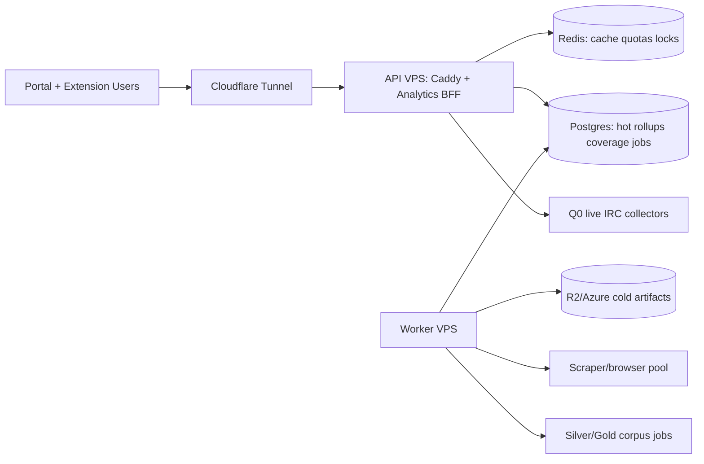

# StreamPulse Hosted Production Improvements Review

Date: 2026-07-07 UTC  
Scope: read-only production review for public StreamPulse portal + Chrome MV3 extension backed by `https://api.streampulse.stream`.

## Executive Go/No-Go

**Recommendation: HOLD for a real public launch; OK only for constrained beta reads while the current cap-250 posture is either rolled back or justified with fresh private soak evidence.**

**Release scope (2026-07 gap closure):** Corpus expansion is **paused** for this release. The gate is **250-channel live tracking stability** plus portal/API/extension GA — not a broad 7-day corpus soak. See [`docs/website-portal/release-gap-closure-tasks.md`](../../website-portal/release-gap-closure-tasks.md) and [`release-status.md`](../../website-portal/release-status.md).

Artifact/repo decision: keep StreamPulse production on Streamclone **source** backend images for this launch phase, but fix promotion discipline in private ops. Successor migration: digest-promoted `streampulse/*` production images — [streamclone-image-exit-audit-2026-07.md](streamclone-image-exit-audit-2026-07.md). Launch decision record: [production-artifact-decision-2026-07.md](production-artifact-decision-2026-07.md). Public promotion contract: streamclone [production-promotion-contract.md](../../../twitch-7tv-clone/docs/production-promotion-contract.md).

The hosted boundary is in good shape: public health works, raw analytics routes are auth-gated or blocked, Grafana is not public, and Cloudflare Tunnel is active. The resource economics review found a more serious issue: live production no longer matches the stated go-forward posture. The prompt model says 4 vCPU / 8 GB / 80 GB with cap 10 and cap 25 only after soak; the live host is now 8 CPU / 23 GiB / 193 GB, running `PULSE_MAX_ACTIVE_CHANNELS=250`, `MAX_ACTIVE_IRC_CHANNELS=250`, protected go-live enabled, corpus workers enabled, and silver auto-enqueue enabled.

This larger box has current headroom, but the safety law is inverted: Q4 corpus work and a cap far beyond the documented cap-25 gate are already running before the review evidence bundle proves they are safe. Public launch should wait until the operator can produce a 24h cap-250 or reduce-to-cap-25 soak with memory, Redis, Postgres write latency, BFF p95, rollup flush p95, GQL throttling, and Cloudflare tunnel error rates.

## Evidence Collected

Read-only checks run from WSL against current production `streampulse-vps` (`23.173.152.156`) and public API:

| Check | Result |
| --- | --- |
| Public health | `ok=true`, `version=v0.3.0-rc18`, hosted mode true, Helix true |
| Public hub | `coverage.state=degraded`, `trackingMax=250`, `backfillMax=1`, `collectorActive=250`, `collectorMax=250`, `topN=1000` |
| Roster snapshot | `live=106`, `collectorTracking=81`, `expectedCollectorRows=106`, `liveCollectorDeficitRows=25`, `metadataStale=0` |
| Boundary smoke | `scripts/pulse-hosted-boundary-smoke.sh` PASS; raw analytics 401/404; admin 401; Grafana route 404/unreachable |
| Hosted exposure smoke | `deploy/smoke/test-013b-hosted.sh` PASS, beta-key positive path skipped because no key was supplied |
| Hosted launch probes | Completed with warnings; `/v1/analytics/top100/readiness?topN=500` is still 404 |
| Host resources | 8 CPU, 23 GiB RAM, 193 GB root, 71 GB free, 1 GB swap with 170 MiB used |
| Docker stats snapshot | analytics 2.5 GiB, MinIO 2.7 GiB, Redis 1.68 GiB, Postgres 628 MiB, worker 556 MiB, scraper 407 MiB |
| Docker limits | No memory/CPU/PID limits on analytics, workers, scraper, Postgres, Redis, MinIO, or Caddy |
| Env caps | analytics: cap 250, top500 admission 250, live admission 250, backfills 1, protected go-live enabled |
| Corpus env | worker: `CORPUS_WORKERS_ENABLED=1`, `SILVER_AUTO_ENQUEUE_ENABLED=true`, `GOLD_BACKFILL_ENABLED=true`, `GOLD_AUTO_ENQUEUE_ENABLED=false` |
| Scraper env | `SCRAPER_MAX_CONCURRENT=1` |
| Postgres | database 6.872 GB; `analytics_minute_rollups` 1.938 GB; `analytics_vod_chat_messages` 923 MB |
| Redis | 1.66 GiB used, 1.69 GiB peak, `maxmemory=0`, `maxmemory_policy=noeviction`, 3,978,359 rejected connections |
| Cloudflare Tunnel | active for 5 days; recent transient QUIC timeout/reconnect and one canceled hub request |
| Soak evidence | `/opt/streamclone/app/runtime/evidence/metadata-overnight-soak.txt` missing on current production host |
| Deploy identity | Docker images mostly `v0.3.0-rc18`; scraper `v0.3.0-rc8`; `DEPLOYED_SHA=ce0774...`; repo `VERSION` file still `v0.3.0-rc4` |

Prometheus/local metrics access was inconclusive during this review. Prior docs say Prometheus should be queried at `127.0.0.1:9090`; quick read-only queries returned no payload in this session, so the review treats Prometheus evidence as a launch-readiness gap until operators attach a successful scrape transcript.

## Resource Budget

Current production is larger than the stated BearHost model. The table below gives both the live measured budget and the planning model for cap 10 / 25. Cap-25 projections use current cap-250 measured memory scaled conservatively for collector-sensitive services while keeping fixed services mostly fixed.

| Service | Live measured at cap-250-ish | Cap-10 planning budget | Cap-25 planning budget | Worst-case / xqc-tier note | Risk |
| --- | ---: | ---: | ---: | --- | --- |
| Analytics API + live collectors | 2.51 GiB, ~24% CPU snapshot | 0.9-1.2 GiB | 1.1-1.6 GiB | Hot chat channel can grow in-memory buffers and PG write pressure faster than channel count suggests | High |
| Analytics workers / corpus | 556 MiB, ~7% CPU | 0 when held | 0 unless isolated | Must stay off the API node or single-worker only during public launch | High |
| Scraper / browser pool | 407 MiB, 177 PIDs, `SCRAPER_MAX_CONCURRENT=1` | 0 if corpus held | 0-500 MiB if canary | Browser memory can spike; keep `SCRAPER_MAX_CONCURRENT=1` | Medium |
| Postgres | 628 MiB RSS; DB 6.9 GB | 0.8-1.2 GiB | 1.0-1.5 GiB | Write latency, temp files, and bloat dominate before raw RAM | High |
| Redis | 1.68 GiB, 786 ops/sec, 3.98M rejected connections | 256-512 MiB if TTLs bounded | 512 MiB-1 GiB | No maxmemory; noeviction can turn memory growth into outages | Critical |
| MinIO / object scratch | 2.71 GiB, heavy IO | 0-512 MiB if cold artifacts off-box | 0-1 GiB | Should not be on the Pulse API hot path for public launch | High |
| Caddy | 26 MiB | 50 MiB | 50 MiB | Cloudflare tunnel is the real ingress dependency | Low |
| Cloudflared | 36 MiB host process | 50 MiB | 50 MiB | Recent transient QUIC errors need alerting, not panic | Medium |
| Metadata/emote services | 9-21 MiB each, plus DB/emote table footprint | 100 MiB | 100 MiB | Emote tables are large in Postgres; service RAM is not the issue | Medium |

### Headroom At Live Host Size

Live host snapshot: 23 GiB total, 7.3 GiB used, 16 GiB available, 71 GB disk free. Sustained memory is currently well below the 85% abort threshold on this larger VPS, but swap is enabled and already used. Swap is not a safety proof; it can hide memory pressure and introduce latency during spikes.

### Headroom If This Were Still 8 GB

The current measured container memory sum is roughly 8.5 GiB before filesystem cache, which would exceed or nearly exhaust the original 8 GB plan. On the original 4c/8GB/80GB profile, the current cap-250 + MinIO + Redis + corpus-worker posture would be a **no-go**. Cap 10 with corpus held remains plausible; cap 25 requires soak evidence.

## Bottleneck Ranking

1. **Redis memory/connection pressure.** Evidence: 1.66 GiB used, no maxmemory, noeviction, only 245 expiring keys out of 13,555, and 3,978,359 rejected connections. This is the clearest production risk because Redis is also quota/cache/lock infrastructure.
2. **Safety-law drift: production cap 250 before documented cap-25 gate evidence.** Evidence: env has `PULSE_MAX_ACTIVE_CHANNELS=250`, `MAX_ACTIVE_IRC_CHANNELS=250`, `LIVE_ADMISSION_TOP_N=250`, protected go-live enabled, and public hub shows cap 250 with 25 live collector deficit rows.
3. **Postgres growth and write pressure.** Evidence: DB is 6.872 GB; rollups 1.938 GB; VOD chat messages 923 MB; temp bytes 1086 GB since stats reset; 25 backends; largest live snapshot partitions are about 60 MB/day. This is no longer the 297 MB June database.
4. **No container resource isolation.** Evidence: Docker inspect reports `mem=0`, `nanoCpus=0`, `cpuQuota=0`, no PIDs limit for every hot service. One runaway browser, Redis growth, MinIO workload, or corpus worker can still starve Q0.
5. **Observability evidence gap.** Evidence: Prometheus query path did not produce usable output in this session; readiness endpoint remains 404; current overnight soak file is missing. Without p95 write/flush/BFF metrics, cap decisions are vibes with some snapshots attached.
6. **Artifact/deploy identity drift.** Evidence: running images are mostly `v0.3.0-rc18`, scraper `v0.3.0-rc8`, `DEPLOYED_SHA` is present, but repo `VERSION` on host is `v0.3.0-rc4`. This weakens rollback confidence and smoke assertions.
7. **Cloudflare Tunnel transient errors.** Evidence: service is active, but recent logs show QUIC stream timeout/reconnect and a canceled `/v1/public/hub` request. Not a blocker alone, but it needs SLO tracking.

## Concrete Tuning List, Cheapest First

1. **Reconcile production cap with launch docs.** Either lower live cap to 25/10 until evidence exists, or attach the private cap-250 soak bundle. The public artifact should state why cap 250 is now intentional.
2. **Set Redis memory and connection policy.** Add `maxmemory` and an eviction policy appropriate for BFF/cache keys, then separate non-evictable locks/quotas if needed. Investigate rejected connections immediately; they suggest maxclients/client churn or connection pooling issues.
3. **Inventory Redis key families and TTLs.** BFF cache, token buckets, job locks, stampede locks, active collector membership, and VOD retry keys should have explicit TTLs. Current keyspace has only 245 expiring keys out of 13,555.
4. **Add Docker resource limits.** Start with soft but real limits: Redis memory, scraper/browser PIDs, analytics worker CPU/memory, MinIO memory/IO expectations, Postgres shared memory budget. Keep Q0 services with priority over Q4.
5. **Move MinIO/object scratch off the hot API node or cap it.** MinIO is one of the largest memory and IO consumers. Public launch posture says VPS is hot node only; cold artifacts should leave promptly to R2/Azure.
6. **Retention/pruning before new datastores.** Partition or prune `analytics_minute_rollups`, daily `top500_live_snapshots_*`, old `analytics_vod_chat_messages`, failed/skipped `backfill_jobs`, and emote rollup history. Export cold aggregates before deletion.
7. **Autovacuum and bloat review.** `emote_set_items` has 1.38M dead tuples; `analytics_minute_rollups` has 187k dead tuples; `emote_usage_minute_rollups` has 191k dead tuples. Tune table-specific autovacuum where needed.
8. **Restore diagnostics route or remove it from launch probes.** `/v1/analytics/top100/readiness` still 404. Keep it blocked publicly if intended, but the operator probe needs a local/private equivalent with a clear pass/fail.
9. **Prometheus scrape proof.** Make `up`, active channels, backfills, HTTP 5xx, rollup latency, and go-live latency queryable from a single read-only script. The launch review should not need ad hoc SSH logs.
10. **Cache public hub at Cloudflare where safe.** Public `/v1/public/hub` and channel aggregate endpoints should have short edge TTL/stale-while-revalidate where semantics allow. Target Redis BFF hit >= 90% for hot channels.
11. **Keep `PULSE_MAX_BACKFILLS=1` and GQL concurrency 1.** Current env meets this. Do not raise until GQL 429/503 rates and PG write p95 are proven under load.
12. **Keep `SCRAPER_MAX_CONCURRENT=1`.** Current env meets this. Do not co-locate expanded browser pools with the Pulse API node.
13. **Align release identity.** Running container image tags, health `version`, `DEPLOYED_SHA`, and ops deployment evidence should all point at the same release. The host `VERSION` file should not contradict health.
14. **Rate-limit public portal reads at the edge.** Public analytics is indexable; add Cloudflare/WAF limits for `/v1/public/*` and portal analytics endpoints before search/bot traffic discovers them.

## Production Readiness Gaps For Full Public Launch

| Gap | Evidence | Launch impact | Required closure |
| --- | --- | --- | --- |
| Cap raised beyond documented gate | Live cap 250, collector max 250 | Invalidates cap-10/cap-25 launch assumptions | Fresh 24h soak or lower cap |
| Corpus no longer on hold | `CORPUS_WORKERS_ENABLED=1`, silver auto-enqueue true, scraper running | Q4 can compete with Q0 on same node | Worker isolation proof or disable for launch |
| Redis unbounded | `maxmemory=0`, noeviction, 3.98M rejected connections | Cache/quota/lock outage risk | Memory cap, TTLs, connection fix |
| No container limits | All hot containers have unlimited memory/CPU | Single service can starve box | Compose limits and restart policy review |
| Missing current soak evidence | `metadata-overnight-soak.txt` absent | Cannot prove SLO stability | New evidence file with thresholds |
| Prometheus evidence not attached | Query path inconclusive | Cannot rank p95s confidently | Attach scrape transcript/dashboard export |
| Readiness route gap | Top100 readiness 404 | Probe warnings hide real regressions | Private readiness route or fallback script |
| Deploy identity drift | rc18 images vs rc4 host `VERSION` | Rollback/audit ambiguity | Single `IMAGE_TAG` bundle evidence |
| Backup/restore proof not observed | Not verified in this read-only pass | Data-loss launch risk | Dated pg_dump/offsite/restore drill |
| Public rate limits unclear | Posture says CDN + governor; no proof here | Indexable API can be abused | Edge rules + per-principal quotas evidenced |
| On-call/alerting unclear | No page targets in evidence | Stop conditions may not be acted on | Alert routing and runbook owner |
| Chrome Web Store listing | Not verified here | Product launch dependency | Listing/privacy-policy final check |

## Safety Restraints Required Before Full Launch

| Restraint | Expected state | Observed / gap |
| --- | --- | --- |
| `PULSE_MAX_ACTIVE_CHANNELS` | 10, then 25 after soak | 250 in production; requires evidence or rollback |
| `PULSE_MAX_BACKFILLS` | 1 | 1 observed |
| GQL concurrency | 1 | Not directly proven; keep at 1 and expose metric |
| Per-principal quotas | Redis token buckets + 429 `retryAfter` | Boundary smoke shows auth; quota positive/negative test not run without beta key |
| Preemption | Protected channels evict lower-priority pool entries | Not proven in live review |
| Kill switches | GQL, backfill, go-live, read-only, Helix | Some env not visible in health; prove operator toggles in staging |
| Queue isolation | Q4 cannot starve Q0 | Violated by evidence posture unless worker isolation metrics are attached |
| VOD finalization | `vod_unavailable` after 60m | Recent logs show unresolved VOD retained as unlinked; finalization proof still needed |
| No raw chat public routes | Server-side sanitization | Boundary smoke PASS |
| Rollback triggers | memory >85%, PG write p95 >250ms, BFF 5xx >1%, reconnect storm | Written docs exist; live alert evidence not attached |

## Scale-Out Triggers

Single VPS is wrong when any of these is true for more than the documented window:

| Signal | Action |
| --- | --- |
| Redis rejected connections continue after pooling/limits | Split Redis or fix client lifecycle before more users |
| Memory >85% sustained for 10m | Disable Q4/corpus, lower cap, add limits; do not buy complexity first |
| PG write p95 >250ms for 10m | Reduce live cap/backfill, tune indexes/autovacuum, partition/prune |
| Rollup flush p95 >5s | Protect Q0: disable backfill/corpus and reduce active collectors |
| BFF 5xx >1% for 5m | Enable read-only if mutations contribute; roll back image if deploy-related |
| Public hub BFF miss p95 rises | Add CDN cache rules and reduce portal poll cadence |
| Silver/gold hurts hosted p95 | Move corpus workers and scraper to worker VPS |
| PG > 20-30 GB or rollups dominate disk | Partition + retention + cold export before ClickHouse |
| Browser/scraper memory spikes | Move scraper/browser pool to worker VPS |
| Clip rendering or ReplayForge resumes | Never run it on the Pulse API node |

### Worker VPS Split

Keep on API node:

- Caddy/Cloudflare origin, analytics BFF, live IRC collectors, rollup flush, Postgres hot store, Redis cache/quota/locks.

Move to worker VPS:

- Corpus silver/gold workers, TwitchTracker/Camoufox scraper pool, IVR/GQL batch fetchers, archive export/packing, clip rendering/ReplayForge.

Do not add yet:

- Kafka, Kubernetes, ClickHouse as product source of truth, cap 500, multiple concurrent user backfills, or 500 simultaneous IRC channels.



## Seven-Day Soak Plan

### Day 0: Reconcile Launch Posture

- Decide whether public launch target is cap 25 or cap 250.
- If cap 25: lower env in ops with rollback plan and smoke after deploy.
- If cap 250: document why the cap-25 gate is superseded and attach private evidence.
- Confirm `IMAGE_TAG` across analytics, metadata, emote, migrate, and worker images; document scraper tag exception if intentional.

### Day 1: Baseline Read-Only Evidence

Commands:

```bash
curl -fsS https://api.streampulse.stream/v1/extension/health | jq .
curl -fsS 'https://api.streampulse.stream/v1/public/hub?activityWindow=30m' | jq .
bash scripts/hosted-launch-probes.sh
bash deploy/smoke/test-013b-hosted.sh
bash scripts/pulse-hosted-boundary-smoke.sh
```

Pass thresholds:

- Hosted health ok, version not `dev`, Helix true.
- Raw analytics/admin/Grafana public exposure blocked.
- Public hub not degraded because of collector capacity deficit.
- Disk free >= 20 GB.

### Day 2: Redis And Container Guardrails

- Set Redis memory/connection alerts before changing traffic.
- Add container memory/CPU/PID limits in ops compose.
- Confirm no OOM kills after limits.
- Target Redis BFF hit >= 90% on hot channels.

Pass thresholds:

- Redis rejected connections stop increasing unexpectedly.
- Redis memory < configured cap with eviction behavior understood.
- No Q0 regressions after limits.

### Day 3: Postgres Retention And Write Evidence

- Capture largest tables, dead tuples, DB growth/day, and write latency.
- Add retention/pruning plan for rollups, VOD chat staging, top500 snapshots, old job rows, and emote rollups.

Pass thresholds:

- PG write p95 < 250ms for 10m under normal load.
- Autovacuum is keeping up or table overrides are planned.
- DB growth does not threaten 20 GB disk floor within 7 days.

### Day 4: Q0 Isolation Soak

- Run cap target with one backfill max, Helix poller enabled, and corpus disabled unless worker isolation is under test.
- Record active channels, first-rollup latency, reconnects, memory, HTTP 5xx, and BFF p95 every 15 minutes.

Pass thresholds:

- Memory <85% sustained.
- Rollup flush p95 <5s.
- Go-live to first rollup p95 <120s target, p99 <600s abort threshold.
- IRC reconnect storm absent.

### Day 5: Corpus Isolation Canary

- Enable one worker lane only if Day 4 passed.
- Keep `SCRAPER_MAX_CONCURRENT=1`, `PULSE_MAX_BACKFILLS=1`, GQL concurrency 1.
- Stop immediately if hosted p95 or Redis/PG metrics regress.

Pass thresholds:

- Hosted API p95 stable.
- GQL 429/503 storm absent.
- Worker queue advances without Q0 delay.

### Day 6: Public Fanout Simulation

- Simulate BFF reads at 10x fanout on hub and hot channel consoles.
- Validate Cloudflare cache headers and origin request rate.

Pass thresholds:

- BFF cache hit p95 <75ms.
- BFF miss p95 <250ms.
- BFF 5xx <1% for 5m.
- Redis hit rate >=90% for hot keys.

### Day 7: Rollback Drill And Final Signoff

- Dry-run rollback order: disable GQL, disable backfill, disable top-roster/corpus, lower active cap, read-only mode, redeploy prior tag.
- Run backup/restore drill proof.
- Attach alert owner and escalation path.

Pass thresholds:

- Rollback commands are written, tested in staging or dry-run, and tied to stop conditions.
- `pg_dump` offsite backup and restore drill are dated.
- Launch owner agrees to stop conditions.

## Stop Conditions

Stop public launch or immediately reduce load if any occur:

- Redis rejected connections continue to rise under normal traffic.
- Memory >85% for 10m or swap use climbs during API latency spikes.
- PG write p95 >250ms for 10m.
- Rollup flush p95 >5s for 10m.
- BFF 5xx >1% for 5m.
- GQL 429/503 storm or retry backoff loop.
- IRC reconnect storm or collector deficit grows at cap.
- Disk free <20 GB.
- Health reports `version=dev`, Helix disabled unexpectedly, or hosted mode false.
- Cloudflare Tunnel repeated reconnects create visible 5xx/timeout impact.

## Top Five Tuning PRs

1. **Ops compose resource limits + Redis maxmemory.** Add limits, document sizing, and smoke Q0 after applying them.
2. **Redis key/connection audit.** Add key-family counts, TTL coverage, connection pool metrics, and rejected connection alert.
3. **Postgres retention package.** Partition/prune rollups and top500 snapshots; archive old VOD chat staging and failed job history.
4. **Launch probe repair.** Replace public 404 readiness route with private/local readiness probe and Prometheus query bundle.
5. **Cap posture reconciliation.** Add an explicit cap target doc/evidence: cap 25 public launch or cap 250 with soak proof.

## Top Five Launch Blockers

1. Production cap 250 and corpus workers active without attached soak evidence.
2. Redis unbounded memory/noeviction plus millions of rejected connections.
3. No container resource limits on Q0/Q4 shared node.
4. Missing current 24h soak evidence with PG write p95, BFF p95, Redis hit rate, rollup flush p95, and memory.
5. Deploy/readiness evidence drift: rc18 images, rc8 scraper, rc4 host `VERSION`, and readiness endpoint 404.

## Final Decision

The system is probably healthy enough for controlled beta reads on the current larger VPS, because live memory headroom is good, public boundaries passed, Q0 logs show first rollups around 48 seconds, and no OOM kills were observed. It is **not ready for an unrestricted public launch** until cap/corpus posture, Redis pressure, resource isolation, and soak evidence are fixed.

The cheapest safe path is: lower or justify cap, bound Redis, add compose limits, rerun a 24h soak, then decide whether cap 25 or cap 250 is the public launch target. Only after that should corpus/silver/gold expansion remain on the same node; otherwise move Q4 work to a worker VPS.