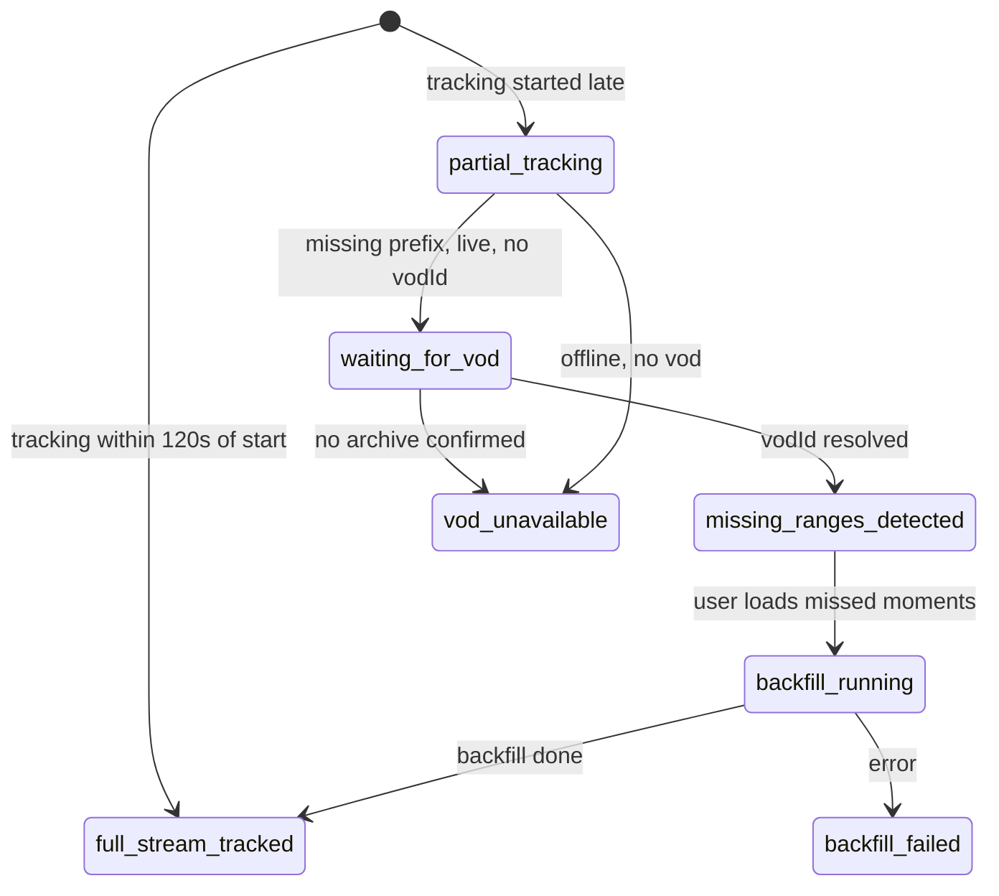

# Streamclone Pulse — Live Coverage, VOD Backfill & Protect Channel

| | |
|---|---|
| **Status** | Draft v1 — requirements |
| **Owner** | Aron-Chu |
| **Scope** | Chrome MV3 extension + **streampulse-vps** hosted analytics backend (+ StreamPulse portal parity) |
| **Related** | [`requirements.md`](requirements.md) · [`design.md`](design.md) · [`website-portal-requirements.md`](website-portal-requirements.md) · streamclone [`roster-naming-truth-table.md`](../../twitch-7tv-clone/docs/pulse-extension/roster-naming-truth-table.md) · `internal/analytics/pulse_coverage.go` · `extension_api.go` |
| **Repos** | Extension: **streamclone-pulse**. Backend: **streamclone** (hosted at `https://api.streampulse.stream` on **streampulse-vps**; operator deploy in private **streampulse-ops**). BearHost is rollback/archive only. |

---

## Product line (canonical)

> **Pulse tracks live from when tracking begins.** If you join late, earlier chat can only be filled when Twitch has a VOD chat replay. **Protect a channel** so future streams are tracked from 00:00 even without a VOD.

This document turns that line into testable requirements. It does **not** promise recovery of arbitrary historical chat.

---

# 1. Overview

Streamclone Pulse shows live chat/emote activity, coverage, peaks (Most Reacted), and “what did I miss?” inside Twitch. Users often open a stream **after it has started** and expect a full chart from 00:00. That expectation fails when:

1. Pulse (the collector) was not watching chat from stream start, **and**
2. Twitch does not expose VOD chat replay for the missing prefix.

This feature area makes Pulse **honest and reliable** when a user joins late:

| Goal | Requirement |
|------|-------------|
| Show what Pulse has tracked live | Chart and copy reflect **coverage start → now**, not fake 00:00 data |
| Backfill earlier chat only when possible | **Load missed moments** runs only when VOD chat replay exists and backend approves |
| Offer a path when backfill is impossible | **Protect this channel** for *future* streams (proactive go-live tracking) |
| Keep surfaces consistent | Extension, hosted API (streampulse-vps), and StreamPulse portal use the **same coverage state model and copy keys** |

### Two data paths (must never be conflated in UX)

```text
Path A — Live tracking
  Collector joins Twitch IRC while stream is live (or shortly after go-live)
  → minute rollups, peaks, lanes
  → does NOT require a VOD
  → full-from-start only if tracking began near stream start (≤ tolerance)

Path B — VOD backfill (“Load missed moments”)
  Fetches Twitch VOD chat replay for missing ranges
  → requires resolvable vodId + Twitch archive chat
  → cannot run for no-VOD / deleted / private / unavailable archives
```

**Live tracking can work while backfill is blocked.** UI must never imply the product is “broken” when only Path B is unavailable.

---

# 2. Definitions

| Term | Definition |
|------|------------|
| **Live tracking** | Streamclone analytics collector watches Twitch chat in real time via IRC (or equivalent ingest) and writes **minute rollups** for the active `streamId`. |
| **VOD backfill** | Batch job that fetches **Twitch VOD chat replay** for missing time ranges, tokenizes emotes, writes rollups, refreshes peaks/moments. Implemented in streamclone `PulseBackfillManager` / `SyncPulseMissedChat`. |
| **Missing prefix** | Stream time `[0, coverageStartOffsetSeconds)` with no completed rollups because tracking started late or collector joined late. |
| **Coverage start** | First completed rollup offset (seconds from stream start). Backend: `coverageStartOffsetSeconds` on pulse payload and nested `coverage.coverageStartOffsetSeconds`. |
| **Full stream tracked** | `coverageStartOffsetSeconds ≤ stream_start_tolerance` (default **120s**) and no material gaps. State: `full_stream_tracked`. |
| **Partial tracking** | Tracking active but chart begins after stream start and/or has gaps. State: `partial_tracking` or derived `missing_ranges_detected`. |
| **Waiting for VOD** | Live stream; missing prefix exists; **no vodId yet** but archive may appear later. State: `waiting_for_vod`. |
| **VOD unavailable** | Missing prefix exists; Twitch will not provide chat replay (no storage, deleted, private, or exhausted checks). State: `vod_unavailable`. |
| **Protected channel** | User intent: track this login from go-live on **future** streams. Maps to watchlist + **`alwaysTrack=true`** on backend. |
| **Always-track** | Backend roster flag: channel stays in shared tracking pool with priority; survives idle eviction subject to caps. Today: `analytics_always_tracked` + `POST /v1/analytics/always-tracked`. |
| **Go-live detector** | Service that learns a channel went live and triggers `watch`/IRC join within SLA. MVP: Helix polling; preferred: EventSub `stream.online`. |
| **Stream start tolerance** | **`≤ 120 seconds`**: if first rollup offset ≤ 120s, treat as **`trackedFromStart=true`** for UX. Matches backend `coverageStartToleranceSec` in `pulse_coverage.go`. |
| **Current live archive / archiveVideo / VOD id** | Twitch video id for the ongoing or ended broadcast. Helix Videos API or GQL `stream.archiveVideo.id`. Stored as `vodId` on stream row. |
| **Rollups** | Per-minute chat/emote/viewer aggregates in Postgres; extension receives windowed rollups via BFF. |
| **Peaks / Most Reacted** | Backend-scored moments from heatmap (`peaks` on pulse payload); extension ranks/displays, does not score. |
| **Backfill job** | Async job with statuses (`queued`, `fetching_chat`, `done`, `failed`, …). Poll via `GET /v1/extension/pulse/backfill/{jobId}`. |

---

# 3. Product truth table

| Situation | Can Pulse track live? | Can it fill missing start? | User message (summary) | Primary CTA |
|-----------|----------------------:|---------------------------:|------------------------|-------------|
| Pulse tracked from ~00:00 | Yes | Not needed | Tracked from stream start | None |
| User joins late + VOD exists / linked | Yes | Yes | Partial coverage; earlier chat loadable from VOD | **Load missed moments** |
| User joins late + waiting for archive | Yes | Maybe later | Live tracking now; archive not published yet | **Try later** · **Protect future streams** |
| User joins late + no VOD ever | Yes | No | Earlier chat cannot be recovered for this stream | **Protect this channel** |
| VOD deleted after stream | Yes if live tracked | No new backfill | VOD chat replay unavailable | **Protect future streams** |
| Backend cannot resolve VOD id (Helix off / stale deploy) | Yes | Blocked until backend fixed | VOD linking unavailable; retrying | **Retry** · fix backend / contact ops |
| Extension GQL blocked (ad blocker) | Yes | Backend Helix may still work | Extension could not verify Twitch archive | Disable blocker for check · rely on backend |
| Protected channel; user not on page | Yes (backend) | N/A for past | Tracked from stream start on future streams | Manage protection in options/portal |

---

# 4. User stories

### US-1 — Late viewer wants honesty
**As a** viewer who opens a live stream 20 minutes in,  
**I want** Pulse to show exactly when tracking began,  
**So that** I understand why 00:00–00:20 is empty and what I can do about it.

**Acceptance:** Chart axis may start at 0, but copy states “Live from 00:20:00 → now” unless backfill completes.

### US-2 — No-VOD streamer
**As a** viewer on a channel that does not store VODs,  
**I want** Pulse to say earlier chat cannot be recovered,  
**So that** I do not wait on a “Waiting for VOD” spinner forever.

**Acceptance:** State `vod_unavailable` or `backfillReason=no_vod`; CTA **Protect this channel**.

### US-3 — Protect favorite channel
**As a** regular viewer,  
**I want** to protect a channel so Pulse tracks from go-live next time,  
**So that** I get full charts even without Twitch VOD storage.

**Acceptance:** `alwaysTrack=true` on backend; next stream `trackedFromStart=true` within SLA.

### US-4 — Waiting for VOD clarity
**As a** viewer seeing “waiting for archive”,  
**I want** to know live tracking still works,  
**So that** I trust the overlay for current moments.

**Acceptance:** Live rollups/peaks update; banner does not block chart; no fake backfill progress.

### US-5 — VOD appears later
**As a** viewer who joined late on a VOD-enabled channel,  
**I want** to load missed moments after Twitch publishes the archive,  
**So that** the chart fills the missing prefix.

**Acceptance:** When `vodId` resolves and `canBackfill=true`, **Load missed moments** succeeds or queues job.

### US-6 — Operator / backend health
**As a** backend operator,  
**I want** `/v1/extension/health` to expose Helix and VOD-hint capability,  
**So that** support can distinguish “no VOD on Twitch” from “BearHost deploy stale”.

### US-7 — Portal parity
**As a** StreamPulse portal user,  
**I want** the same coverage badges and CTAs as the extension,  
**So that** I am not confused switching surfaces.

---

# 5. Coverage state model

### 5.1 Canonical states

Backend is source of truth. Extension and portal **must not** infer state from DOM/GQL alone.

```ts
type CoverageState =
  | "full_stream_tracked"      // implemented
  | "partial_tracking"         // implemented
  | "missing_ranges_detected"  // implemented
  | "waiting_for_vod"          // implemented
  | "vod_unavailable"          // implemented
  | "backfill_available"       // PROPOSED — derived when canBackfill && vodId (may map to missing_ranges_detected today)
  | "backfill_running"         // implemented
  | "backfill_failed"          // implemented
  | "already_available";       // PROPOSED for coverage UX when backfill job returns already_available (today: job status only)
```

**Mapping note (current codebase):** streamclone `pulse_coverage.go` implements the first seven states except `backfill_available` and `already_available`. Extension `missedMoments.ts` may **derive** `waiting_for_vod` client-side when backend omits nested `coverage` — backend should always send canonical `coverage` on hosted API.

### 5.2 Target payload (with field mapping)

```ts
type PulseCoverage = {
  state: CoverageState;
  streamId: string;                    // top-level pulse payload today: streamId
  login: string;                       // top-level: login
  isLive: boolean;                     // top-level: isLive
  tracking: boolean;                   // top-level: tracking
  protected: boolean;                  // PROPOSED — login in always-track / watchlist protect set
  alwaysTrack: boolean;                // PROPOSED — backend always-track row
  trackedFromStart: boolean;           // PROPOSED — coverageStartOffsetSeconds <= 120
  coverageStartOffsetSeconds: number | null;  // EXISTS top-level + coverage.*
  coverageEndOffsetSeconds: number | null;    // EXISTS coverage.*
  missingRanges: Array<{
    fromOffsetSeconds: number;
    toOffsetSeconds: number;
  }>;                                  // EXISTS coverage.missingRanges
  vodId: string | null;                // EXISTS top-level vodId
  vodStatus:                           // PROPOSED
    | "unknown"
    | "resolving"
    | "available"
    | "waiting_for_live_archive"
    | "unavailable"
    | "deleted"
    | "private"
    | "error";
  canBackfill: boolean;                // EXISTS coverage.canBackfill
  backfillReason:                      // EXISTS coverage.backfillReason (extend enum)
    | "vod_available"
    | "waiting_vod"
    | "no_vod"
    | "vod_deleted"
    | "already_full"
    | "not_live"
    | "backend_unavailable"
    | "rate_limited"
    | null;
  copyKey: string;                    // PROPOSED — i18n key for portal/extension shared copy
};
```

| Proposed field | Current API | Notes |
|----------------|-------------|-------|
| `protected` / `alwaysTrack` | Not on pulse payload | Infer from `/v1/analytics/always-tracked` or future `/v1/pulse/watchlist` |
| `trackedFromStart` | Not explicit | Compute: `coverageStartOffsetSeconds <= 120` |
| `vodStatus` | Not explicit | Derive from Helix + last resolution attempt |
| `helixEnabled` | On pulse payload + health | Already in `ExtensionPulseResponse` when deployed |
| `copyKey` | Not present | e.g. `coverage.partial_vod_waiting` |

### 5.3 State transition (simplified)



---

# 6. Extension UX requirements

### 6.1 Source of truth

| ID | Requirement |
|----|-------------|
| UX-1 | Extension **must not** guess final coverage state from local DOM/GQL alone. |
| UX-2 | Extension **must** mirror backend `coverage.state`, `canBackfill`, `vodId`, and (when available) `protected`, `trackedFromStart`, `vodStatus`. |
| UX-3 | Extension may send **VOD hints** (`POST .../vod-hint`) and run **fallback** page/GQL discovery; backend remains authoritative for `vodId` and backfill. |
| UX-4 | Client-side `resolvePulseCoverage()` is a **fallback** when nested `coverage` is missing; hosted API must send full `coverage` object. |

### 6.2 CTAs and visibility

| ID | Requirement |
|----|-------------|
| UX-5 | Show **Load missed moments** only when `canBackfill === true` **and** `vodId` is non-empty (or backend explicitly allows hint-only backfill with body `vodId`). |
| UX-6 | Show **Protect this channel** when coverage is partial and backfill is unavailable, waiting, or `vod_unavailable`. |
| UX-7 | Show **Tracked from stream start** when `trackedFromStart === true` (or `coverageStartOffsetSeconds <= 120`). |
| UX-COV-8 | Do **not** show the late-start banner when `trackedFromStart` or offset ≤ 120. For **`active_live_coverage`** + tracking + offset 121–600s, use soft copy (“Live chat from {time} — earlier minutes need VOD replay”); reserve harsh “Rollups since … tracking started after stream start” for large gaps, out-of-cap joins, or when backfill is not yet actionable. |
| UX-8 | **No fake progress** — indeterminate shimmer only while a real backfill job or explicit VOD check is in flight. |
| UX-9 | **Never imply live tracking is broken** when only backfill is blocked. Live chart/peaks must still update. |
| UX-10 | Display coverage start: **“Live from {offset} → now”** (e.g. `00:15:00`). |
| UX-11 | If `helixEnabled` is missing/false or health version is stale/`dev` on hosted API, show **backend health warning** (not ambiguous VOD spinner). |
| UX-12 | On GQL/ad-block failures in extension fallback, show copy that names the issue; do not treat as “no VOD on Twitch”. |

### 6.3 Copy examples (canonical)

Keys should map to `copyKey` for portal parity.

```text
coverage.full_from_start.title
  Tracked from stream start
coverage.full_from_start.body
  Pulse has tracked this stream from the beginning. VOD backfill is not needed.

coverage.partial.title
  Partial coverage
coverage.partial.body
  Pulse started tracking at {coverageStart}. Earlier chat can only be loaded if Twitch publishes a VOD.

coverage.waiting_archive.title
  Waiting for Twitch archive
coverage.waiting_archive.body
  Pulse is tracking live now. Earlier chat may become available if Twitch publishes a VOD.

coverage.no_vod.title
  No VOD available
coverage.no_vod.body
  Earlier chat cannot be recovered for this stream. Protect this channel so future streams are tracked from 00:00.

coverage.protect.title
  Protect this channel
coverage.protect.body
  StreamPulse will start tracking as soon as this channel goes live, so future streams can show moments from the beginning even without a VOD.

coverage.backend_stale.title
  Backend VOD linking unavailable
coverage.backend_stale.body
  Hosted analytics needs an update (Helix/VOD-hint). Live tracking still works; backfill is blocked until the server is updated.

coverage.gql_blocked.title
  Could not check Twitch archive
coverage.gql_blocked.body
  An ad blocker or network issue blocked archive lookup in the extension. Backend may still resolve the VOD.
```

### 6.4 “From stream start” (player vs analytics)

| Action | Behavior |
|--------|----------|
| **From stream start** (LiveStatsBand) | Seek live DVR to 0 when on live channel; expand chart timeline. **Does not** imply analytics backfill. |
| **Load missed moments** | Triggers backfill job; fills **analytics** rollups for missing prefix. |

Copy when DVR seek succeeds but analytics partial:

```text
Chart expanded from stream start — chat data begins at {coverageStart}. Backfill needs a Twitch VOD link.
```

---

# 7. Protect this channel requirements

**Protect this channel** is the proactive product answer for Case B (no VOD / late join on current stream).

| ID | Requirement |
|----|-------------|
| PRO-1 | User can enable protection from extension (current channel) and options/portal watchlist. |
| PRO-2 | Protection sets backend **`alwaysTrack=true`** for the login (watchlist row or always-tracked table). |
| PRO-3 | **One shared IRC/rollup session per channel**, refcounted across users — not one session per user. |
| PRO-4 | Protected channels **preempt** normal watched channels when tracking cap is reached. |
| PRO-5 | On go-live, tracking starts within **30–120 seconds** (SLA target). Hosted cap admission defaults **`PULSE_TOP500_ADMISSION_INTERVAL=30s`** and **`PULSE_PROTECTED_GOLIVE_INTERVAL=30s`** until EventSub (GL-4) ships. |
| PRO-6 | If `coverageStartOffsetSeconds ≤ 120`, set **`trackedFromStart=true`**. |
| PRO-7 | User can disable protection; backend stops prioritizing; eviction rules apply after idle TTL. |
| PRO-8 | Extension shows **Protected** badge when backend confirms `alwaysTrack` for current login. |
| PRO-9 | Protection applies to **future streams only**; it does not recover missing chat on the **current** stream unless VOD backfill succeeds. |
| PRO-10 | Extension watchlist sync today uses `POST /v1/analytics/always-tracked` — portal MVP may add `/v1/pulse/watchlist`; both must converge on same backend pool. |

---

# 8. Hosted backend requirements (streampulse-vps)

| ID | Requirement |
|----|-------------|
| BE-1 | Hosted API exposes canonical pulse payload with nested **`coverage`** on every `GET /v1/extension/pulse/channels/{login}`. |
| BE-2 | **`GET /v1/extension/health`** returns at minimum: `ok`, `version`, `helixEnabled`. **Proposed additions:** `vodHintEnabled`, `goLiveDetector` (`eventsub` \| `helix_poll` \| `disabled`), `hostedMode`. |
| BE-3 | Backend resolves **`vodId` server-side** via Helix (`VideoIDByStreamID`, Videos API) and **`POST .../vod-hint`**. |
| BE-4 | VOD resolution **retry schedule** while live and after offline: immediate, **30s, 2m, 5m, 15m** after stream end (configurable). |
| BE-5 | Extension DOM/GQL is **hint-only**; backend is source of truth for `vodId` and `canBackfill`. |
| BE-6 | Backend distinguishes and exposes via logs/metrics/`vodStatus`: no VOD yet · unavailable · Helix disabled · VOD linked · backfill ready. |
| BE-7 | Cache VOD resolution attempts (Redis) to avoid hammering Helix/GQL on every poll. |
| BE-8 | Actionable errors on backfill: `waiting_for_vod`, `vod_unavailable`, `rate_limited`, `backend_unavailable`. |
| BE-9 | **`STREAMCLONE_VERSION`** / git SHA on health — not permanent `"dev"` on production. |
| BE-10 | Beta key middleware on hosted pulse routes (existing `pulseHosted.BetaKeyRequired()`). |

### Deploy verification (operator)

```bash
curl https://api.streampulse.stream/v1/extension/health
# Expect: ok, version != dev, helixEnabled: true (when OAuth configured)

curl -H "X-Streamclone-Beta-Key: $KEY" \
  https://api.streampulse.stream/v1/extension/pulse/channels/{login}?window=full
# Expect: coverage.state, coverageStartOffsetSeconds, vodId, canBackfill
```

---

# 9. Go-live detection requirements

### 9.1 MVP fallback — Helix polling

| ID | Requirement |
|----|-------------|
| GL-1 | Poll protected + always-track roster every **30–120s** (hosted default **30s**). Top-N live admission uses the same interval target via `PULSE_TOP500_ADMISSION_INTERVAL`. |
| GL-2 | On live detection, invoke internal **`POST /v1/analytics/channels/{login}/watch`** path. |
| GL-3 | Acceptable for beta if EventSub not wired. |

### 9.2 Preferred — EventSub

| ID | Requirement |
|----|-------------|
| GL-4 | Subscribe to **`stream.online`** for protected / top-roster broadcaster IDs. |
| GL-5 | On event, join chat within SLA; Helix poll as reconciliation backup. |
| GL-6 | Deduplicate go-live events per `streamId`. |
| GL-7 | Never duplicate IRC sessions for same channel. |

### 9.3 Priority and caps

```text
1. protected / always-track
2. active user watchlist (explicit watch)
3. top-roster / corpus tier
4. opportunistic (user on page, extension track)
```

| Env (examples) | Purpose |
|----------------|---------|
| `MAX_CONCURRENT_TRACKED_CHANNELS` | Max simultaneous live IRC joins (prod profile: **200**; pulse dev profile: **10**) |
| `BRONZE_TOP_N` | Roster size (**500** in prod corpus profile) |
| `PULSE_MAX_ACTIVE_CHANNELS` | Hosted beta cap per deployment |
| `PULSE_TOP500_ADMISSION_INTERVAL` | Helix top-live admission poll (hosted default **30s**) |
| `PULSE_PROTECTED_GOLIVE_INTERVAL` | Protected / always-track go-live poll (hosted default **30s**) |

### 9.4 Ops — late cap-start observability

| ID | Requirement |
|----|-------------|
| OPS-LATE-1 | When a cap-tier source (`top_roster`, `always_track`, `protected`) writes its first rollup **>120s** after Twitch stream start, increment **`pulse_late_cap_start_total{source}`** and surface alert guidance in [`pulse-metrics-runbook.md`](../../twitch-7tv-clone/docs/pulse-extension/pulse-metrics-runbook.md) §8. |

---

# 10. Backfill requirements

| ID | Requirement |
|----|-------------|
| BF-1 | Backfill runs only when **`vodId` exists** and **missing ranges** exist (or late-start prefix). |
| BF-2 | Backfill fetches **VOD chat replay** (Twitch GQL/API path in `SyncPulseMissedChat`), not live IRC history. |
| BF-3 | Backfill writes rollups, refreshes peaks/moments, updates coverage. |
| BF-4 | Jobs are **queued**, **rate-limited**, **deduped** by stream + range. |
| BF-5 | No backfill for confirmed **no-VOD** streams. |
| BF-6 | No promise of recovery if VOD **deleted / private / unavailable**. |
| BF-7 | Accept optional **`vodId` in POST body** (extension hint) when stream row lacks vodId. |

### Backfill job statuses (existing)

Align with streamclone `pulse_backfill.go`:

`queued` · `resolving_vod` · `waiting_for_vod` · `ensuring_emotes` · `fetching_chat` · `tokenizing` · `writing_rollups` · `refreshing_moments` · `done` · `already_available` · `failed` · `cancelled`

Extension polls **`GET /v1/extension/pulse/backfill/{jobId}`** — show **real** `progress.percent` when present.

---

# 11. Top roster / 500-channel requirements

**“Top 500” = roster / protected set, not 500 simultaneous IRC joins.**

| Tier | Suggested cap | Notes |
|------|---------------|-------|
| Roster size | 500 | `BRONZE_TOP_N` |
| Active live tracking (beta) | **25–50** | Raise after metrics stable |
| Active live tracking (prod target) | **100–200** | Existing prod env reference |
| Backfill concurrency | **1–3** initially | Queue remainder |

### Metrics (required before raising caps)

- `active_tracked_channels`
- `messages_per_second` (aggregate)
- `rollup_flush_latency_p95`
- CPU / RAM on analytics-workers
- Postgres write latency
- Redis BFF cache hit rate
- IRC reconnects / disconnects
- VOD resolution success rate
- Backfill success / failure rate
- `tracked_from_start_ratio`
- `partial_coverage_sessions` (no VOD)

**Preemption:** When cap hit, evict lowest priority idle channels; **never** evict protected without explicit policy.

---

# 12. API requirements

### 12.1 Implemented today (streamclone)

| Method | Path | Purpose |
|--------|------|---------|
| GET | `/v1/extension/health` | Health + `helixEnabled` |
| GET | `/v1/extension/pulse/channels/{login}?window=recent\|full` | Pulse BFF payload |
| POST | `/v1/extension/pulse/channels/{login}/vod-hint` | Client VOD id hint |
| POST | `/v1/extension/pulse/channels/{login}/backfill` | Start missed-moments backfill |
| GET | `/v1/extension/pulse/backfill/{jobId}` | Backfill status |
| POST | `/v1/analytics/channels/{login}/watch` | Start tracking / collector join |
| GET/POST | `/v1/analytics/always-tracked` | List/set always-tracked logins |

Extension local watchlist syncs to **`always-tracked`** via service worker (`syncWatchlistToBackend`).

### 12.2 Proposed (StreamPulse MVP — see website-portal design)

| Method | Path | Purpose |
|--------|------|---------|
| GET/POST/DELETE | `/v1/pulse/watchlist` | Principal-scoped watchlist + `alwaysTrack` |
| POST | `/v1/pulse/watchlist/{login}/protect` | Alias: enable `alwaysTrack` |
| DELETE | `/v1/pulse/watchlist/{login}/protect` | Alias: disable protect |
| GET | `/v1/pulse/coverage/{login}` | Optional thin coverage-only endpoint (or use pulse payload) |

**Rule:** Do not duplicate backfill or watch logic — aliases route to existing analytics handlers.

---

# 13. Security and abuse requirements

| ID | Requirement |
|----|-------------|
| SEC-1 | No unauthenticated public **`/watch`** on hosted API. |
| SEC-2 | Beta key or future device auth on hosted pulse routes. |
| SEC-3 | Rate-limit protect/watch/backfill per **principal** and **IP**. |
| SEC-4 | **One IRC session per channel** (shared pool). |
| SEC-5 | Extension/portal expose **rollups/peaks only** — no raw chat export. |
| SEC-6 | Never trust client-supplied `principalId` without server verification. |
| SEC-7 | Never commit beta keys, OAuth secrets, or `.env` to git. |
| SEC-8 | **No Twitch OAuth required** for extension MVP. |
| SEC-9 | Store analytics aggregates, not chatter identity, in extension-visible payloads. |

---

# 14. Observability requirements

### 14.1 Health and config visibility

- `helixEnabled`, `vodHintEnabled`, `goLiveDetector`, `version` on health endpoint
- Alert if hosted health shows `helixEnabled=false` or `version=dev` > 24h

### 14.2 Structured logs

- VOD resolution attempt (login, streamId, source: helix \| hint \| gql, result)
- VOD unavailable reason
- protect on/off (login, principal)
- go-live detected (login, streamId, detector)
- IRC join started / stopped
- coverage start offset at first rollup
- backfill job lifecycle transitions

### 14.3 Metrics

- `pulse_protected_channels`
- `pulse_active_tracked_channels`
- `pulse_tracked_from_start_total`
- `pulse_vod_resolution_success_rate`
- `pulse_backfill_success_rate` / `pulse_backfill_failure_rate`
- `pulse_coverage_start_offset_seconds` (histogram)
- `pulse_partial_no_vod_sessions`

---

# 15. Acceptance criteria

| # | Criterion |
|---|-----------|
| AC-1 | Tracking begins ≤120s from stream start → extension shows **Tracked from stream start**; no backfill CTA. |
| AC-2 | Tracking begins at 15m, no VOD → **Partial coverage** + **Protect this channel**; no infinite “Waiting for VOD”. |
| AC-3 | Tracking begins at 15m, VOD linked → **Load missed moments** visible; job fills prefix or reports honest failure. |
| AC-4 | BearHost stale (`helixEnabled` missing/false) → **backend health warning**, not fake VOD wait. |
| AC-5 | Protect enabled before go-live → IRC join within **30–120s**; next stream `trackedFromStart=true`. |
| AC-6 | No-VOD stream, late join → UI states **cannot recover**; live chart still updates. |
| AC-7 | Backfill never runs without **vodId**. |
| AC-8 | No fake progress bars without job percent or explicit in-flight check. |
| AC-9 | 500 roster ≠ 500 IRC joins; caps enforced with preemption rules. |
| AC-10 | Portal watchlist badge matches extension for same login + principal. |

---

# 16. Non-goals

- Recover deleted/no-VOD chat for arbitrary past streams without prior live capture.
- Scrape third-party chat history sites as a core dependency.
- Require Twitch OAuth in extension MVP.
- Ship raw chat to clients or public archive.
- Run **500 simultaneous VOD backfills**.
- Client-side Pulse scoring or rollup math.
- Promise “full chart from 00:00” on every live stream regardless of tracking start or VOD policy.

---

# 17. Open questions

| # | Question | Options / notes |
|---|----------|-----------------|
| OQ-1 | MVP go-live: Helix poll first or EventSub immediately? | Poll = faster ship; EventSub = better SLA |
| OQ-2 | Beta active-live cap: 25, 50, or 100? | Start 25–50 on BearHost Pulse |
| OQ-3 | VOD retry window after stream end? | Proposed 30s / 2m / 5m / 15m — extend to 1h? |
| OQ-4 | Protected channels per beta key limit? | Align with `PULSE_MAX_CHANNELS_PER_PRINCIPAL` (portal design: 10) |
| OQ-5 | Keep extension VOD discovery as fallback only? | **Recommended yes** — backend primary |
| OQ-6 | Shared `CoverageCard` in `@streamclone/pulse-core`? | Reduces extension/portal drift |
| OQ-7 | When to finalize `vod_unavailable` vs `waiting_for_vod`? | After N failed Helix checks or timeout (e.g. 15m live + 30m post-end) |
| OQ-8 | Separate `backfill_available` coverage state vs derive from `canBackfill`? | Avoid state explosion |

---

# 18. Engineering notes & criticisms (for implementers)

These are intentional product/engineering guardrails discovered during the BearHost debug session (2026-06):

1. **Do not conflate player seek with analytics backfill.** “From stream start” on live DVR is cheap; filling rollups is not.
2. **Extension GQL is unreliable as primary VOD source** — ad blockers and Client-ID context caused false “no VOD” signals. Backend Helix must lead.
3. **`broadcastId` ≠ `vodId`.** Stream id and video id must not be mixed in scrape/hint pipelines.
4. **`waiting_for_vod` on a no-VOD channel is a trust bug.** Must transition to `vod_unavailable` after policy timeout.
5. **Protect is the honest upsell** when Case B applies — not another backfill retry loop.
6. **Capacity planning:** live IRC scales with **concurrent live channels**, not roster size; backfill scales with **job queue depth**, not viewer count.
7. **BFF cache (12s Redis on pulse payload)** is load-critical when many viewers share one channel — preserve when adding coverage fields.

---

## Revision history

| Date | Version | Change |
|------|---------|--------|
| 2026-06-23 | v1 draft | Initial requirements from live coverage / BearHost debug work |
