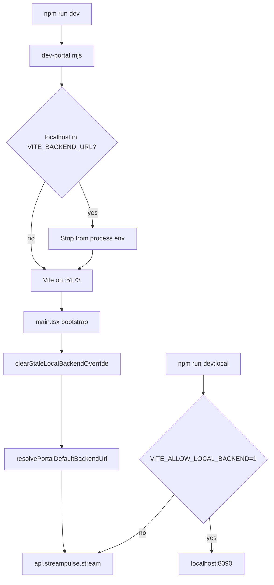

# StreamPulse portal — local dev runbook (hosted-first)

After launch hardening (2026-07), portal dev defaults to the **hosted production API** — not the local Streamclone stack at `:8090`. Use this checklist before `/analytics` work, hub QA, or portal screenshots.

## Prerequisites

1. Sibling **streamclone** checkout at `../../twitch-7tv-clone` (for `@streamclone/analytics-console` and `@streamclone/pulse-core` file deps).
2. From `streampulse-web/`:

```bash
npm install
```

Re-run `npm install` after pulling portal or streamclone package changes.

## Default dev (hosted API)

```bash
cd streampulse-web
npm run dev
# or: npm run dev:hosted
```

| Item | Value |
|------|-------|
| Vite URL | `http://127.0.0.1:5173` |
| Backend | `https://api.streampulse.stream` |
| Hub poll | 45s default (`VITE_PUBLIC_HUB_POLL_MS`) |

No beta key required for `/analytics`. No local Docker stack required.

## Opt-in local stack (`:8090`)

Only when explicitly debugging Go BFF / local analytics:

1. Copy `streampulse-web/.env.development.localhost.example` → `.env.development.localhost`.
2. **Must include** `VITE_ALLOW_LOCAL_BACKEND=1` — without it, localhost `VITE_BACKEND_URL` is ignored.
3. In streamclone checkout: `make up` (Caddy `:8090`).
4. Rebuild/restart local **analytics** if `/v1/public/hub` returns 404 (extension health may work while hub route does not).
5. Run:

```bash
npm run dev:local
```

Expect a tiny IRC pool and different hub data vs production. `HubBackendSourceBanner` warns when not on hosted.

## What the code enforces

| Mechanism | Effect |
|-----------|--------|
| [`scripts/dev-portal.mjs`](../../scripts/dev-portal.mjs) | Strips `localhost` / `:8090` from `VITE_BACKEND_URL` when starting default `npm run dev` |
| [`src/lib/auth.ts`](../../streampulse-web/src/lib/auth.ts) `resolvePortalDefaultBackendUrl()` | Ignores localhost env unless `VITE_ALLOW_LOCAL_BACKEND=1` |
| [`src/main.tsx`](../../streampulse-web/src/main.tsx) `clearStaleLocalBackendOverride()` | Removes stale `sessionStorage.sp.backendUrlOverride` pointing at `:8090` on boot |
| [`src/hooks/usePublicHubData.ts`](../../streampulse-web/src/hooks/usePublicHubData.ts) | Default poll 45s — do not lower without evidence (see fanout doc) |

### Backend resolution flow



## Scalability guardrails

- Portal QA and hub screenshots should use **hosted** API unless the task explicitly says local-stack debugging.
- Hub poll cadence: see [hub-fanout-edge-cache.md](./hub-fanout-edge-cache.md) — browser default 45s, backend Redis TTL ~30s, origin `Cache-Control` on `/v1/public/hub`.
- Do not point portal dev at `localhost:8090` for “representative” production hub/moment/emote checks.

## Troubleshooting

| Symptom | Likely cause | Fix |
|---------|--------------|-----|
| `/analytics` hangs on “Loading…” 30s+ (dev) | Cold Vite compile of lazy hub chunk; or `localhost` IPv6 stall | Use **`http://127.0.0.1:5173/analytics`**; wait for Vite terminal to finish first compile; hard refresh |
| Blank black page, empty `#root` | Stale Vite on `:5173` after long session or git rebase | Kill process on port 5173, restart `npm run dev`, hard refresh (Ctrl+Shift+R) |
| Port 5173 serves old bundle | Zombie dev server | `netstat -ano \| findstr :5173` (Windows) → kill PID → restart |
| Module / `@streamclone/*` errors | Missing `npm install` or sibling checkout | `npm install` in `streampulse-web`; confirm `../../twitch-7tv-clone/packages/` exists |
| Hub empty but page renders | Off-peak live pool or wrong backend | Confirm hosted hub: `curl -sI https://api.streampulse.stream/v1/public/hub` |
| Unexpected local backend | Session override or env | DevTools → Application → `sessionStorage.sp.backendUrlOverride`; check `.env.development.local*` |
| `dev:local` still hits hosted | Missing `VITE_ALLOW_LOCAL_BACKEND=1` | Update `.env.development.localhost` from example |
| Local hub 404 | Old analytics image | Rebuild analytics in streamclone stack; curl `http://localhost:8090/v1/public/hub` |

## Verify

```bash
# Portal dev server up
curl -s -o NUL -w "%{http_code}" http://127.0.0.1:5173/analytics

# Hosted hub reachable
curl -sI "https://api.streampulse.stream/v1/public/hub?activityWindow=24h" | findstr /i cache-control
```

When on hosted (default): no `HubBackendSourceBanner` warning; hub KPIs reflect production IRC pool.

## Related docs

- [design.md](./design.md) — portal architecture
- [hub-fanout-edge-cache.md](./hub-fanout-edge-cache.md) — Day 6 fanout / poll discipline
- [streampulse-web/README.md](../../streampulse-web/README.md) — npm scripts and deploy
