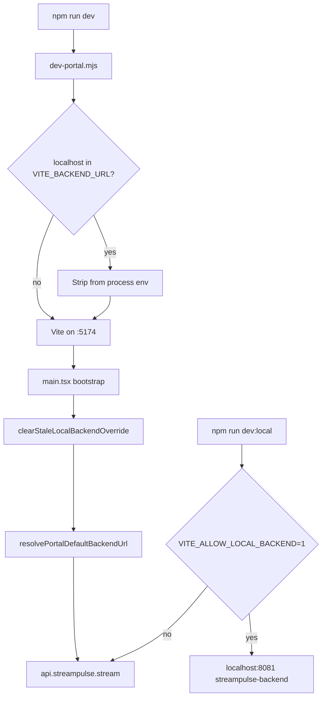

# StreamPulse portal — local dev runbook (hosted-first)

After launch hardening (2026-07), portal dev defaults to the **hosted production API** — not a local stack. Use this checklist before `/analytics` work, hub QA, or portal screenshots.

## Which checkout

`wip/hub-landing` merged in [PR #25](https://github.com/Aron-Chu/streamclone-pulse/pull/25). Use the main `streamclone-pulse` checkout for portal and extension.

```bash
cd C:/Users/Aron/streamclone-pulse/streampulse-web
npm install   # after branch switch or @streampulse/* changes
npm run check:package-cohort   # required while this branch uses the explicit sibling override
npm run dev
```

See [`docs/contributing-wip-split.md`](../contributing-wip-split.md).

## Prerequisites

1. This branch uses the explicit sibling package override in [`config/local-package-overrides.json`](../../config/local-package-overrides.json), pointing at `../../streampulse-backend/packages/*`. Run `npm run check:package-cohort` before startup. It reports the source branch/commit and fails if a link is missing or points somewhere else. The source checkout is currently dirty by design while WIP is reconciled; that state is visible as a warning. Release/CI uses `npm run check:package-cohort:strict`, which rejects dirty sibling source.
2. From `streampulse-web/`:

```bash
npm install
```

Re-run `npm install` after pulling portal or streampulse-backend package changes.

3. Portal Vite must alias landing extension UI: `@pulse-ext/ui` → repo-root `src/ui`, plus `extensionUiShimsPlugin` in `streampulse-web/vite.config.ts`. Without that, `/` and `/analytics` both fail module resolve (Landing is eagerly imported in the router). Hosted API is unrelated to that failure.

Public **Streamclone** (`../../twitch-7tv-clone`, `:8090`) is the desktop watch stack only — **not** extension/portal BFF after boundary split.

## Default dev (hosted API)

```bash
cd C:/Users/Aron/streamclone-pulse/streampulse-web
npm run dev
```

| Item | Value |
|------|-------|
| Vite URL | `http://127.0.0.1:5174` |
| Backend | `https://api.streampulse.stream` |
| Hub poll | 45s default (`VITE_PUBLIC_HUB_POLL_MS`) |

No beta key required for `/analytics`. No local Docker stack required.

### Reproducible WIP snapshot

When the dirty sibling package cohort or repeated restarts make the UI look like a mixed version, use the isolated snapshot lane documented in [`stable-local-runtime.md`](./stable-local-runtime.md):

```bash
npm run runtime:capture -- --id portal-stable-YYYYMMDD
npm run dev:stable -- --id portal-stable-YYYYMMDD
```

The snapshot serves the same hosted API on `127.0.0.1:5174`, records the portal/extension/package hashes, and exposes its identity at `/healthz` and in the build banner.

## Opt-in local StreamPulse backend

Only when explicitly debugging Go BFF / local analytics:

1. Copy `streampulse-web/.env.development.localhost.example` → `.env.development.localhost`.
2. **Must include** `VITE_ALLOW_LOCAL_BACKEND=1` — without it, localhost `VITE_BACKEND_URL` is ignored.
3. In **streampulse-backend** checkout: `make up` (TODO — compose Caddy `:8081` → analytics `:8080`).
4. Rebuild/restart local **analytics** if `/v1/public/hub` returns 404 (extension health may work while hub route does not).
5. Run:

```bash
npm run dev:local
```

Default local URL: `http://localhost:8081` (streampulse-backend). Do **not** point portal local dev at Streamclone `:8090`.

Expect a tiny IRC pool and different hub data vs production. `HubBackendSourceBanner` warns when not on hosted.

## What the code enforces

| Mechanism | Effect |
|-----------|--------|
| [`scripts/dev-portal.mjs`](../../scripts/dev-portal.mjs) | Strips `localhost` / `:8081` from `VITE_BACKEND_URL`, reserves `:5174`, and restarts on env/Vite/package-cohort changes when starting `npm run dev` |
| [`src/lib/auth.ts`](../../streampulse-web/src/lib/auth.ts) `resolvePortalDefaultBackendUrl()` | Ignores localhost env unless `VITE_ALLOW_LOCAL_BACKEND=1` |
| [`src/main.tsx`](../../streampulse-web/src/main.tsx) `clearStaleLocalBackendOverride()` | Removes stale `sessionStorage.sp.backendUrlOverride` pointing at local backend on boot |
| [`src/hooks/usePublicHubData.ts`](../../streampulse-web/src/hooks/usePublicHubData.ts) | Default poll 45s — do not lower without evidence (see fanout doc) |

### Backend resolution flow



## Scalability guardrails

- Portal QA and hub screenshots should use **hosted** API unless the task explicitly says local-backend debugging.
- Hub poll cadence: see [hub-fanout-edge-cache.md](./hub-fanout-edge-cache.md) — browser default 45s, backend Redis TTL ~30s, origin `Cache-Control` on `/v1/public/hub`.
- Do not point portal dev at Streamclone `:8090` for “representative” production hub/moment/emote checks.

## Troubleshooting

| Symptom | Likely cause | Fix |
|---------|--------------|-----|
| `/analytics` hangs on “Loading…” 30s+ (dev) | Cold Vite compile of lazy hub chunk; or `localhost` IPv6 stall | Use **`http://127.0.0.1:5174/analytics`**; wait for Vite terminal to finish first compile; hard refresh |
| Blank black page, empty `#root` | Stale Vite on `:5174` after long session or git rebase | Kill process on port 5174, restart `npm run dev`, hard refresh (Ctrl+Shift+R) |
| Port 5174 serves old bundle | Zombie dev server **or wrong worktree** | Confirm `/healthz` reports `service=streampulse-portal`, uses strict port `5174`, and displays the build identity before restarting |
| Looks like “old” Command Center | A stale server, stale `dist`, or linked sibling package | Run `npm run check:package-cohort` and `npm run check:dist` from both the extension root and `streampulse-web`; use the main `streamclone-pulse` checkout |
| Module / `@streampulse/*` errors | Missing `npm install` or unapproved sibling checkout | Run `npm run check:package-cohort`; then `npm install` in `streampulse-web` and confirm the manifest target exists |
| Hub empty but page renders | Off-peak live pool or wrong backend | Confirm hosted hub: `curl -sI https://api.streampulse.stream/v1/public/hub` |
| Unexpected local backend | Session override or env | DevTools → Application → `sessionStorage.sp.backendUrlOverride`; check `.env.development.local*` |
| `dev:local` still hits hosted | Missing `VITE_ALLOW_LOCAL_BACKEND=1` | Update `.env.development.localhost` from example |
| Local hub 404 | Old analytics image or wrong stack | Use **streampulse-backend** compose; curl `http://localhost:8081/v1/public/hub` |
| Duplicate Pulse Moments + Top Moments on session page | Both panels mounted in `analytics-console` | Pull latest; restart dev; run `npm install` after backend package edits |
| Session VOD link points at wrong broadcast | Cross-session `fallbackVodId` | Fixed in `@streampulse/analytics-console` — only current session row |

## Before restarting `:5174` after package edits

Portal UI imports `@streampulse/analytics-console` and `@streampulse/pulse-charts` via `file:../../streampulse-backend/packages/*`. After editing those packages:

```bash
cd streampulse-web
npm install
npm run check:analytics-overlap   # fails if duplicate stacks reintroduced
npm run typecheck && npm test
```

The wrapper clears `node_modules/.vite` automatically when package manifests or the local cohort override changes. If HMR still serves stale console code, stop the wrapper, start `npm run dev` again, and hard-refresh the browser (Ctrl+Shift+R). `--no-watch-config` is available only for deliberately one-shot config sessions.

## Why overlap keeps coming back (and what blocks it now)

| Cause | What happens | Enforcement |
|-------|----------------|-------------|
| Agents **add** features without **deleting** old mounts | Two moment lists, two charts, wrong VOD fallback | `npm run check:analytics-overlap` (also in `build` + `pages:deploy:prod`) |
| Two repos (`streampulse-web` + backend packages) | Fix in one checkout, deploy bundles the other | `npm install` after package edits; commit hook runs overlap check |
| `:5174` restart ≠ clean slate | Old behavior is still in source until gated/deleted | Overlap script greps source, not cache |
| No package cohort gate | A portal build can silently consume a different dirty sibling checkout | `npm run check:package-cohort` runs before portal dev/build and records the source commit/dirty state |
| No CI gate on duplicate patterns | Regressions ship on deploy | Deploy script runs overlap check before Vite build |

Cursor: rule `.cursor/rules/analytics-no-duplicate-stack.mdc` + commit hook `.cursor/hooks/analytics-overlap-pre-commit.py`.

## Verify

```bash
# Portal dev server up
curl -s -o NUL -w "%{http_code}" http://127.0.0.1:5174/analytics

# Hosted hub reachable
curl -sI "https://api.streampulse.stream/v1/public/hub?activityWindow=24h" | findstr /i cache-control

# Local backend (when compose up)
curl -fsS http://localhost:8081/v1/extension/health
```

When on hosted (default): no `HubBackendSourceBanner` warning; hub KPIs reflect production IRC pool.

## Related docs

- [contributing-wip-split.md](../contributing-wip-split.md) — retired hub-worktree history and current ownership
- [design.md](./design.md) — portal architecture
- [hub-fanout-edge-cache.md](./hub-fanout-edge-cache.md) — Day 6 fanout / poll discipline
- [streampulse-web/README.md](../../streampulse-web/README.md) — npm scripts and deploy
- [streampulse-backend/AGENTS.md](../../../streampulse-backend/AGENTS.md) — backend router
